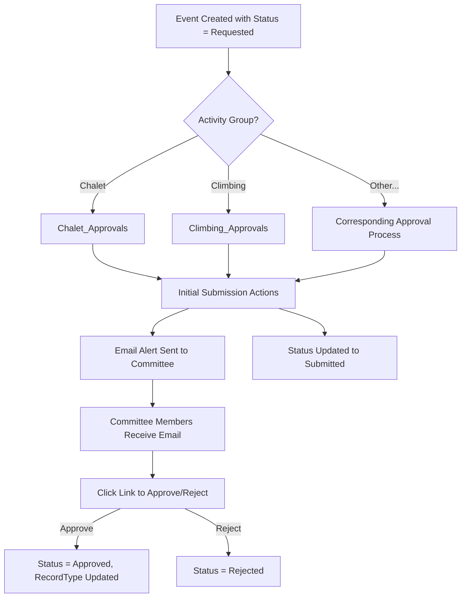

# Event Approval Email Alerts

This documentation covers the email alert automation for Event Registration approval processes, ensuring committee chairs receive notifications when new events are submitted for approval.

---

## Access

- Workflow Alerts: [Setup → Workflow Rules → Email Alerts](https://spokanemountaineers.lightning.force.com/lightning/setup/WorkflowEmails/home)
- Approval Processes: [Setup → Approval Processes](https://spokanemountaineers.lightning.force.com/lightning/setup/ApprovalProcesses/home)
- GitHub: [Event_Registration\_\_c.workflow-meta.xml](https://github.com/jasonkradams/smi/blob/main/force-app/main/default/workflows/Event_Registration__c.workflow-meta.xml)

---

## Purpose

These email alerts notify activity group committee members when a new event is submitted for approval. Each activity group has its own:

- **Approval Queue** - Holds pending approval requests
- **Committee Group** - Public group containing committee members who should receive notifications
- **Email Alert** - Sends the notification email to the committee group

---

## Components

### Email Alerts (Workflow Alerts)

| Alert Name                        | Recipient Group             | Description                              |
| --------------------------------- | --------------------------- | ---------------------------------------- |
| `Email_Chalet_Committee`          | `Chalet_Committee`          | Chalet Committee Event Approval          |
| `Email_Climbing_Committee`        | `Climbing_Committee`        | Climbing Committee Event Approval        |
| `Email_Clubwide_Committee`        | `Clubwide_Approvers`        | Clubwide Committee Event Approval        |
| `Email_Conservation_Committee`    | `Conservation_Committee`    | Conservation Committee Event Approval    |
| `Email_Hiking_Committee`          | `Hiking_Committee`          | Hiking Committee Event Approval          |
| `Email_Mountain_Biking_Committee` | `Mountain_Biking_Committee` | Mountain Biking Committee Event Approval |
| `Email_Paddling_Committee`        | `Paddling_Committee`        | Paddling Committee Event Approval        |
| `Email_Road_Biking_Committee`     | `Road_Biking_Committee`     | Road Biking Committee Event Approval     |
| `Email_Skiing_Committee`          | `Skiing_Committee`          | Skiing Committee Event Approval          |

### Email Configuration

All alerts share the same configuration:

- **Sender**: `admin@spokanemountaineers.org` (Org-Wide Email Address)
- **Template**: `unfiled$public/Event_Approval_Request_Alert`

### Email Template

**Developer Name**: `Event_Approval_Request_Alert`

**Subject**:

```
A New {!Event_Registration__c.Activity_Group__c} Event Has Been Requested For Spokane Mountaineers
```

**Body**:

```
Hi,

{!Event_Registration__c.CreatedBy} has requested your approval for the following event:

{!Event_Registration__c.Name}
{!Event_Registration__c.Start__c} at {!Event_Registration__c.Location__c}
Led by: {!Event_Registration__c.Leader__c}

Please click this link to approve or reject this event:
{!Event_Registration__c.Link}

Thank you,
Spokane Mountaineers
```

---

## Approval Process Configuration

Each approval process includes two key elements:

### 1. Email Template Reference

Added after the `<approvalStep>` section:

```xml
<emailTemplate>unfiled$public/Event_Approval_Request_Alert</emailTemplate>
```

### 2. Email Alert in Initial Submission Actions

Added to `<initialSubmissionActions>`:

```xml
<initialSubmissionActions>
    <action>
        <name>Email_{ActivityGroup}_Committee</name>
        <type>Alert</type>
    </action>
    <action>
        <name>Submitted_Status</name>
        <type>FieldUpdate</type>
    </action>
</initialSubmissionActions>
```

---

## Approval Process List

| Approval Process            | Queue                            | Entry Criteria                     |
| --------------------------- | -------------------------------- | ---------------------------------- |
| `Chalet_Approvals`          | `Chalet_Approval_Queue`          | Activity_Group = "Chalet"          |
| `Climbing_Approvals`        | `Climbing_Approval_Queue`        | Activity_Group = "Climbing"        |
| `Clubwide_Approvals`        | `Clubwide_Approval_Queue`        | Activity_Group = "Clubwide"        |
| `Conservation_Approvals`    | `Conservation_Approval_Queue`    | Activity_Group = "Conservation"    |
| `Hiking_Approvals`          | `Hiking_Approval_Queue`          | Activity_Group = "Hiking"          |
| `Mountain_Biking_Approvals` | `Mountain_Biking_Approval_Queue` | Activity_Group = "Mountain Biking" |
| `Paddling_Approvals`        | `Paddling_Approval_Queue`        | Activity_Group = "Paddling"        |
| `Road_Biking_Approvals`     | `Road_Biking_Approval_Queue`     | Activity_Group = "Road Biking"     |
| `Skiing_Approvals`          | `Skiing_Approval_Queue`          | Activity_Group = "Skiing"          |

---

## Data Model

### Objects Used

| Object                  | Purpose                             | Key Fields                                                                       |
| ----------------------- | ----------------------------------- | -------------------------------------------------------------------------------- |
| `Event_Registration__c` | Event record submitted for approval | `Name`, `Activity_Group__c`, `Status__c`, `Leader__c`, `Start__c`, `Location__c` |
| `Group`                 | Public groups for committee members | `DeveloperName`, `Name`, `Type`                                                  |
| `User`                  | Committee member user records       | `Id`, `Email`, `Name`                                                            |

### Relationships

- `Event_Registration__c.Leader__c` → `User` (Lookup)
- `Event_Registration__c.Activity_Group__c` → Determines which approval process runs
- Committee Groups contain Users who receive email alerts

---

## Flow: How Approval Works



---

## Monitoring & Troubleshooting

### Verify Email Delivery

Query to check if emails are being sent:

```sql
SELECT Id, ToAddress, Subject, CreatedDate, Status
FROM EmailMessage
WHERE CreatedDate = TODAY
AND Subject LIKE '%Event%Requested%'
ORDER BY CreatedDate DESC
```

### Check Approval Process Execution

Query to verify approval process is running:

```sql
SELECT Id, TargetObjectId, Status, CreatedDate,
       (SELECT Id, ActorId, OriginalActorId, StepStatus FROM StepsAndWorkitems)
FROM ProcessInstance
WHERE TargetObject.Type = 'Event_Registration__c'
AND CreatedDate = TODAY
ORDER BY CreatedDate DESC
```

### Common Issues

| Issue                   | Possible Cause                | Solution                                                        |
| ----------------------- | ----------------------------- | --------------------------------------------------------------- |
| No email received       | User not in committee group   | Add user to the appropriate `{Activity}_Committee` group        |
| No email received       | Wrong Activity Group on event | Verify `Activity_Group__c` matches expected value               |
| Email to wrong people   | Wrong group configured        | Verify email alert recipients match committee group             |
| Approval not triggering | Status not "Requested"        | Verify `Status__c = 'Requested'` when event created             |
| Email not sending       | Invalid sender address        | Verify Org-Wide Email `admin@spokanemountaineers.org` is active |

### Verify Group Membership

Query to check who is in a committee group:

```sql
SELECT GroupId, Group.Name, UserOrGroupId, UserOrGroup.Name
FROM GroupMember
WHERE Group.DeveloperName = 'Chalet_Committee'
```

---

## Adding a New Activity Group

To add email alerts for a new activity group:

### 1. Create the Public Group

1. Setup → Users → Public Groups
2. Create group: `{ActivityGroup}_Committee`
3. Add committee members

### 2. Create the Email Alert

Add to `Event_Registration__c.workflow-meta.xml`:

```xml
<alerts>
    <fullName>Email_{ActivityGroup}_Committee</fullName>
    <description>{ActivityGroup} Committee Event Approval</description>
    <protected>false</protected>
    <recipients>
        <recipient>{ActivityGroup}_Committee</recipient>
        <type>group</type>
    </recipients>
    <senderAddress>admin@spokanemountaineers.org</senderAddress>
    <senderType>OrgWideEmailAddress</senderType>
    <template>unfiled$public/Event_Approval_Request_Alert</template>
</alerts>
```

### 3. Update the Approval Process

Add to the approval process XML:

1. Email template reference after `</approvalStep>`:

```xml
<emailTemplate>unfiled$public/Event_Approval_Request_Alert</emailTemplate>
```

2. Email alert in `<initialSubmissionActions>`:

```xml
<action>
    <name>Email_{ActivityGroup}_Committee</name>
    <type>Alert</type>
</action>
```

### 4. Deploy

```bash
sf project deploy start --source-dir force-app/main/default/workflows/Event_Registration__c.workflow-meta.xml \
  --source-dir force-app/main/default/approvalProcesses \
  --target-org production
```

---

## Technical Details

- **API Version**: 64.0
- **Metadata Types**: `Workflow`, `WorkflowAlert`, `ApprovalProcess`
- **Email Template Type**: Classic Email Template (Text)
- **Template Folder**: `unfiled$public`

---

## Related Documentation

- [Fixing Approval Email Notifications (Article)](../articles/fixing-approval-email-notifications.md): Overview of the problem and solution
- [Notify Leader on RSVP](notify-leader-on-rsvp.md): Related email notification automation

---

## Future Enhancements

| Feature                     | Notes                                                                |
| --------------------------- | -------------------------------------------------------------------- |
| Flow Approval Orchestration | Migrate to modern approval system (Spring '25+) for better debugging |
| HTML Email Template         | Format approval emails with HTML for better presentation             |
| Approval Reminder           | Send reminder if approval pending > 3 days                           |
| Mobile Deep Links           | Add mobile-friendly approval links                                   |

---

## Support

For issues or questions about approval email alerts, contact the tech team at [webdev@spokanemountaineers.org](mailto:webdev@spokanemountaineers.org).
